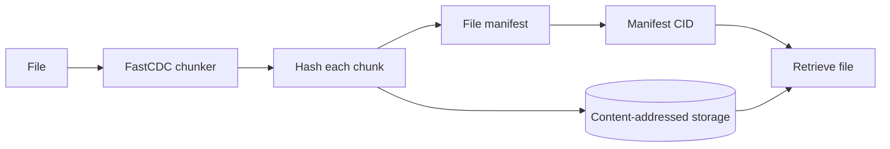

<div align="center">
<p align="center"></p>

# Strata

**Local, content-addressed file storage built in Go.**

Split files into stable chunks, deduplicate their contents, and retrieve them
later from a single manifest CID.

[](https://github.com/mexirica/strata/actions/workflows/ci.yml)
[](https://github.com/mexirica/strata/actions/workflows/release.yml)
[](https://github.com/mexirica/strata/releases/latest)
[](go.mod)
[](https://goreportcard.com/report/github.com/mexirica/strata)

</div>

Strata is a single-node content-addressed store backed by
[BadgerDB](https://github.com/dgraph-io/badger). It uses content-defined
chunking to avoid storing duplicate data and keeps a compact manifest for each
file. The CLI provides the complete lifecycle: add, discover, restore, remove,
collect, and verify.

## Features

- **Content-defined chunking** - FastCDC finds stable chunk boundaries, so
	small edits do not require storing an entire file again.
- **Automatic deduplication** - identical chunks share the same content ID and
	storage entry.
- **Verifiable content** - choose BLAKE3 or SHA-256; reads verify data against
	its CID.
- **Streaming retrieval** - files are reconstructed chunk by chunk instead of
	being loaded entirely into memory.
- **Repository maintenance** - garbage collection removes unreferenced chunks,
	while scrubbing detects missing or corrupted data.
- **Portable configuration** - YAML configuration, command-line path override,
	and `STRATA_*` environment variables through Viper.

## How It Works



Each manifest records the original name, byte size, and ordered chunk CIDs.
The CID printed by `strata add` identifies that manifest and is the handle used
by `get` and `remove`.

## Installation

### APT (Debian/Ubuntu)

```bash
curl -fsSL https://mexirica.github.io/strata/cli/public-key.gpg | sudo gpg --dearmor -o /usr/share/keyrings/strata-cli-archive-keyring.gpg
echo "deb [signed-by=/usr/share/keyrings/strata-cli-archive-keyring.gpg] https://mexirica.github.io/strata/cli stable main" | sudo tee /etc/apt/sources.list.d/strata-cli.list
sudo apt update && sudo apt install strata
```

The `/cli` repository path is intentionally separate so future Strata
executables can have independent package repositories.

### Go

```bash
go install github.com/mexirica/strata/cmd/cli@latest
```

### Build From Source

Requires Go 1.27.1 or newer.

```bash
git clone https://github.com/mexirica/strata.git
cd strata
mkdir -p bin
go build -trimpath -o bin/strata ./cmd/cli
```

Optionally install the binary somewhere on your `PATH`:

```bash
install -Dm755 bin/strata "$HOME/.local/bin/strata"
```

For development, the CLI can be run directly:

```bash
go run ./cmd/cli --help
```

## Quick Start

Create a repository in the current directory:

```bash
strata init
```

This writes `strata.yaml` and creates `.strata/data`. You can then store and
restore a file:

```bash
# Store a file and capture its manifest CID.
CID=$(strata add ./document.pdf)

# Discover stored files.
strata list

# Restore the file to a new path.
strata get "$CID" ./restored.pdf
```

Remove the manifest when it is no longer needed, then reclaim its unreferenced
chunks:

```bash
strata remove "$CID"
strata gc --dry-run
strata gc
```

## Commands

| Command | Description |
| --- | --- |
| `strata init` | Create the configuration file and data directory |
| `strata add <file>` | Store a file and print its manifest CID |
| `strata get <cid> <destination>` | Restore a file to the destination path |
| `strata list` | List manifest CIDs, human-readable sizes, and file names |
| `strata remove <cid>` | Remove a file manifest |
| `strata gc` | Remove chunks that are not referenced by any manifest |
| `strata gc --dry-run` | Report unreferenced chunks without deleting them |
| `strata scrub` | Verify the integrity of every manifest and chunk |

Every command accepts `--config <path>`. The default path is `strata.yaml`.

## Configuration

Running `strata init` creates the default configuration. A complete copy is
also available in [strata.yaml.example](strata.yaml.example).

```yaml
data_dir: .strata/data
hash_algorithm: blake3
min_chunk_size: 262144
normal_chunk_size: 1048576
max_chunk_size: 4194304
max_file_size: 10737418240
max_chunks: 40960
max_name_bytes: 4096
```

| Setting | Default | Description |
| --- | ---: | --- |
| `data_dir` | `.strata/data` | BadgerDB repository directory |
| `hash_algorithm` | `blake3` | Content hash: `blake3` or `sha256` |
| `min_chunk_size` | `262144` | Minimum chunk size in bytes |
| `normal_chunk_size` | `1048576` | Target chunk size in bytes; must be a power of two |
| `max_chunk_size` | `4194304` | Maximum chunk size in bytes |
| `max_file_size` | `10737418240` | Maximum accepted file size in bytes |
| `max_chunks` | `40960` | Maximum chunks in one file manifest |
| `max_name_bytes` | `4096` | Maximum UTF-8 file name length in bytes |

Settings can be overridden with environment variables prefixed by `STRATA_`:

```bash
STRATA_DATA_DIR=/mnt/archive/strata strata list
STRATA_HASH_ALGORITHM=sha256 strata --config ./archive.yaml init
```

Relative `data_dir` values are resolved from the directory containing the
configuration file.

> [!IMPORTANT]
> The hash algorithm and chunking parameters determine stored object IDs.
> Keep them consistent for the lifetime of a repository.

## Repository Maintenance

### Garbage Collection

Removing a manifest does not immediately remove its chunks because another
manifest may still reference them. Preview collection first:

```bash
strata gc --dry-run
```

Run `strata gc` without the flag to delete unreferenced chunks.

### Integrity Check

```bash
strata scrub
```

The command verifies manifest encoding, chunk availability, chunk hashes, and
the reconstructed file size. It exits with an error when an integrity issue is
found.

### Data Directory

The configured data directory contains BadgerDB files such as `.sst`, `.vlog`,
`MANIFEST`, `DISCARD`, and `KEYREGISTRY`. They are implementation details:

> [!WARNING]
> Do not edit individual database files or open the same repository from
> multiple Strata processes. Back up or move the complete data directory only
> while Strata is not running.

## Development

The repository is organized by executable entrypoints and internal packages:

```text
cmd/cli/                 CLI executable
internal/cas/            Content-addressed chunk storage
internal/chunker/        FastCDC chunking
internal/cid/            Content identifier encoding
internal/cli/            Cobra commands and Viper configuration
internal/fileservice/    File storage and retrieval
internal/maintenance/    Garbage collection and scrubbing
internal/manifeststore/  File manifest persistence
internal/node/           Single-node facade
internal/storage/        BadgerDB storage adapter
```

Run the complete test suite:

```bash
go test ./...
```

Run the same checks used by CI:

```bash
go vet ./...
go test -race -coverprofile=coverage.out ./...
mkdir -p bin
go build -trimpath -o bin/strata ./cmd/cli
```

The [CI workflow](.github/workflows/ci.yml) runs these checks on every push and
pull request and publishes the compiled CLI and coverage profile as artifacts.

Contributors changing storage behavior or persisted formats should start with
the [internals documentation](docs/internals/README.md), which covers the
architecture, data flows, concurrency model, integrity guarantees, and test
expectations.

## Project Status

Strata is currently preparing its first experimental release, `v0.1.0`. The
local CLI and single-process repository workflow are functional and covered by
automated tests, but the project is not yet production-ready.

The repository format may change before `v1.0.0`. There is not yet a supported
backup and restore workflow, so important data should always have an independent
copy outside Strata.

Development is proceeding in stages:

1. Harden repository metadata, compatibility checks, failure recovery, backup,
	garbage collection, and integrity inspection.
2. Add recursive file ingestion as a CLI convenience. Directories will not be
	persisted or exposed as objects; every discovered file remains independent.
3. Introduce an experimental hybrid backend with manifests and metadata in
	BadgerDB and content-addressed chunks in blob storage.
4. Add a daemon and transport-neutral API before building a TUI or distributed
	replication.

## License

Strata is available under the [MIT License](LICENSE).