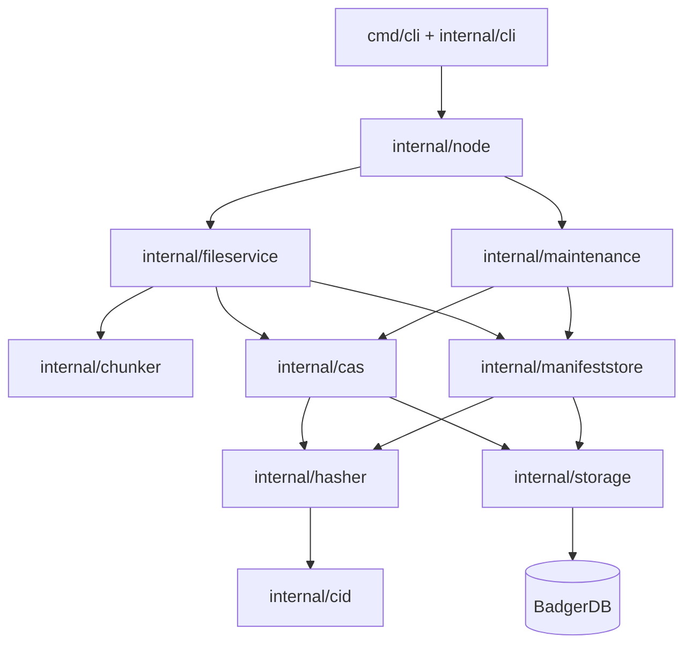

# Architecture

Strata is a layered content-addressed file store. The CLI is deliberately a
thin adapter; storage policy and integrity checks live below it.

## Dependency Direction



Dependencies point from orchestration toward storage primitives. The
composition root is [`node.New`](../../internal/node/node.go), which validates
configuration, opens Badger, and wires concrete implementations together.
There is no global service locator or second metadata database.

## Package Responsibilities

| Package | Responsibility |
| --- | --- |
| [`cmd/cli`](../../cmd/cli) | CLI executable entrypoint |
| [`internal/cli`](../../internal/cli) | Cobra commands, Viper configuration, and local file I/O |
| [`internal/node`](../../internal/node) | Public facade, dependency composition, lifecycle, and operation locking |
| [`internal/fileservice`](../../internal/fileservice) | File validation, chunk orchestration, manifest creation, and reconstruction |
| [`internal/chunker`](../../internal/chunker) | Streaming FastCDC splitting with bounded buffers |
| [`internal/cas`](../../internal/cas) | Hash-addressed chunk writes and verified reads |
| [`internal/manifeststore`](../../internal/manifeststore) | Canonical manifest encoding, verification, CRUD, and pagination |
| [`internal/maintenance`](../../internal/maintenance) | Mark-and-sweep collection and integrity inspection |
| [`internal/cid`](../../internal/cid) | Self-describing binary and textual content identifiers |
| [`internal/hasher`](../../internal/hasher) | BLAKE3 and SHA-256 implementations selected by CID algorithm |
| [`internal/storage`](../../internal/storage) | Backend contract and BadgerDB adapter |

## Ownership Boundaries

`storage.ObjectStore` owns byte persistence but does not understand chunks or
manifests. `cas.Store` owns chunk identity. `manifeststore.Store` owns manifest
identity and serialization. `fileservice.FileService` coordinates both stores
without depending on Badger directly.

`node.Node` is the concurrency boundary. Calling lower-level services directly
bypasses its repository-wide coordination and is intended only for focused
tests or future composition work.

## Repository Model

A repository contains two logical object classes in one Badger database:

```text
manifest CID -> encoded manifest -> ordered chunk CIDs
                                      |      |      |
                                      v      v      v
                                  chunk bytes in CAS
```

Identical chunks share one storage entry. Manifests are independent roots and
may share any number of chunks. Removing a manifest changes reachability but
does not mutate the shared chunks; garbage collection performs reclamation.

## Executable Layout

The user-facing binary lives at `cmd/cli`. Additional process types, such as a
future daemon, can get their own directory under `cmd` without coupling their
lifecycle to Cobra command execution.

## Deliberate Limits

- The repository is local and single-process.
- A CLI invocation opens and closes a node for one command.
- Configuration is not stored inside the repository.
- There is no schema migration or repository-format negotiation layer.
- Reachability for garbage collection is held in memory.
- Maintenance scans use paginated snapshots rather than one database-wide
  snapshot.
