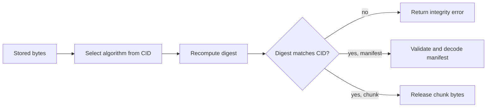

# Concurrency and Integrity

Strata combines repository-wide coordination in `node.Node` with
content-level verification in the manifest and CAS stores.

## Node Locking

`Node` owns an `sync.RWMutex` and applies it as follows:

| Operation | Lock | Duration |
| --- | --- | --- |
| Store | Shared | Until manifest creation succeeds or fails |
| Retrieve | Shared | Until the returned reader is closed |
| Delete | Shared | Until the manifest deletion completes |
| List | Shared | For the facade call |
| Scrub | Shared | For the complete inspection |
| Garbage collection | Exclusive | For the complete mark-and-sweep run |
| Close | Exclusive | Until Badger closes |

Store, retrieve, delete, list, and scrub can overlap. Garbage collection cannot
overlap any facade operation, which prevents it from deleting chunks between a
chunk write and manifest publication or while a retrieval is open.

`Close` is idempotent through `sync.Once`, but it waits for active operations.
A retrieval reader that is never closed can therefore block both garbage
collection and shutdown indefinitely.

## Atomicity Boundaries

The atomic unit is one storage operation, not one file:

- each chunk insertion is independently atomic and idempotent;
- manifest insertion is atomic only after all chunks exist;
- manifest deletion is one transaction;
- each scan page has its own Badger read snapshot;
- garbage collection's node lock stabilizes facade reachability, but its pages
  do not form one database transaction;
- scrub uses a shared lock and may observe concurrent stores or deletes across
  pages.

This favors bounded transactions and recoverable leaks over a large transaction
covering arbitrary file sizes. Interrupted stores can leak chunks, but cannot
publish a manifest that references a chunk the store never wrote.

## Verification Chain

Manifest bytes are verified before decoding. Chunk bytes are verified before
streaming. Retrieval additionally checks that chunk lengths cannot exceed the
declared size and that final reconstruction is exact. The system fails closed:
hash-invalid data is returned as an error, never as file contents.

## Failure Cases

| Failure point | Observable result | Repository consequence |
| --- | --- | --- |
| Source read or chunking | Store returns an error | Earlier chunks may be orphaned |
| Chunk write | Store returns an error | No manifest is published |
| Manifest write | Store returns an error | All written chunks remain unreachable |
| Manifest corruption | Get/list/scrub reports an error | Chunks remain untouched |
| Missing or corrupt chunk | Retrieval fails while reading | Manifest remains for diagnosis |
| Early retrieval close | Producer is canceled | Lock is released; repository unchanged |
| GC delete failure | GC returns an error | Undeleted garbage remains recoverable |

## Process Boundary

The node lock coordinates goroutines in one process only. Badger provides its
own directory lock, and the supported operational model is one Strata process
per repository. There is no cross-process operation protocol or distributed
lease.

## Configuration Validation

`node.New` rejects unsafe or unrepresentable configurations, including:

- chunk sizes that do not satisfy $0 < min < target < max$;
- a FastCDC minimum below 64 bytes;
- a target size that is not a power of two;
- a maximum chunk size above 64 MiB;
- nonpositive file, chunk-count, or name limits;
- counts or name lengths that cannot fit their manifest fields;
- manifest allocations that cannot fit an `int`;
- a maximum file size greater than `maxChunks * minChunkSize`.

The final rule is conservative: it guarantees the chunk-count limit for any
valid split, but may reject a configuration that would usually fit with larger
average chunks.
