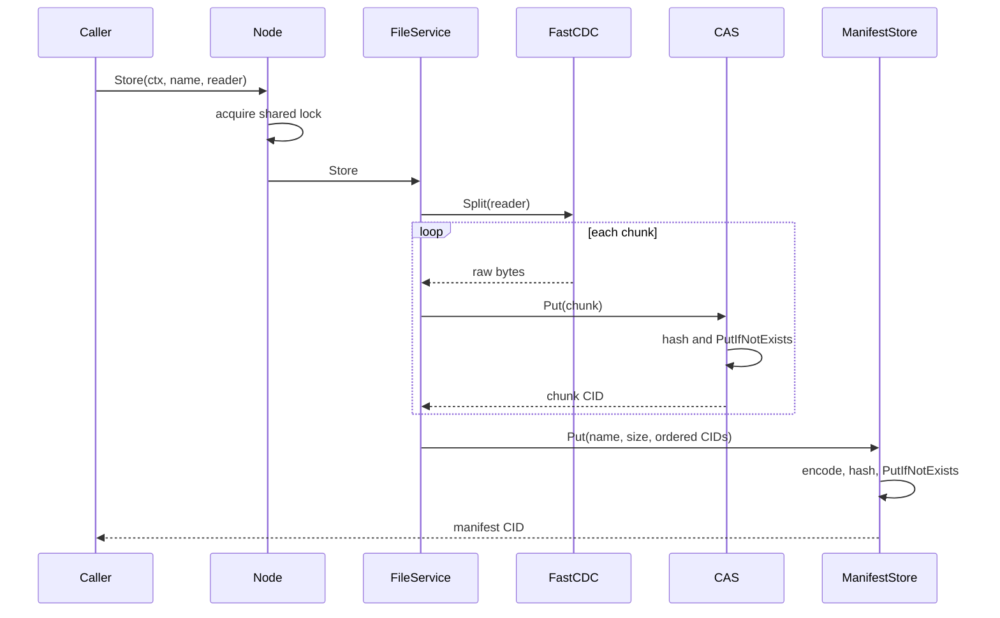
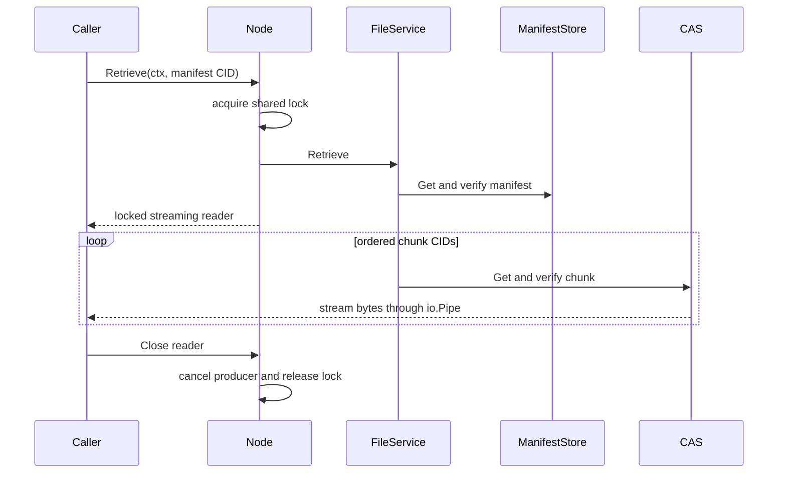
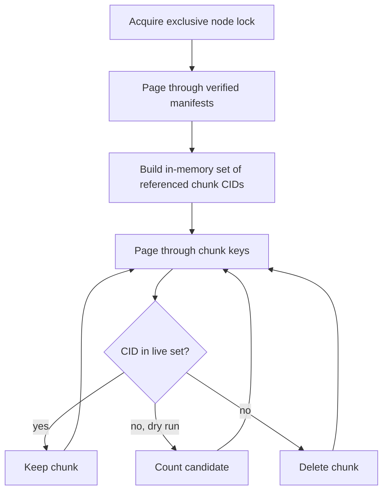

# Data Flows

This guide follows the high-level operations from `node.Node` to persisted
objects. Storage and retrieval are streaming; neither requires the complete
file in memory.

## Store

`FileService.Store` validates context, reader, UTF-8 name, total size, and
chunk count while streaming. FastCDC uses a pooled maximum-sized buffer.
Chunks become durable before the manifest makes them reachable. If reading,
chunking, or manifest creation fails, already-written chunks are harmless
orphans eligible for garbage collection.

## Retrieve

The producer rejects a chunk that would exceed the declared file size and
requires the final reconstructed size to match exactly. Errors may therefore
surface while the caller reads, not only when `Retrieve` returns.

The returned reader must be closed even when the caller stops early. Closing
cancels the producer goroutine and releases the node lock exactly once.

## List

Manifest listing scans `manifest:` keys in CID order. A cursor is the last CID
from the previous page and is exclusive. The implementation inspects one extra
key to determine whether another page exists. Every result is loaded,
hash-verified, and decoded; one corrupt manifest aborts the page rather than
returning untrusted metadata.

The node and CLI use pages of at most 1,000 manifests.

## Delete

Delete removes only the manifest key. It is idempotent at the Badger layer and
does not inspect or delete chunks because other manifests may reference them.
Chunk reclamation belongs exclusively to garbage collection.

## Garbage Collection

The exclusive lock prevents stores and deletes from changing reachability
during collection. In dry-run mode, `ChunksDeleted` in the result means chunks
that would be deleted. Memory use scales with the number of unique reachable
chunk CIDs.

## Scrub

Scrub is a read-only diagnostic pass:

1. enumerate manifest keys;
2. load, hash-verify, and decode each manifest;
3. load and hash-verify every referenced chunk;
4. compare successfully read bytes with the manifest size;
5. report corrupted manifests, missing chunks, corrupted chunks, and size
   mismatches.

Scrub neither repairs nor quarantines data. It only follows manifest roots, so
corrupt unreferenced chunks are outside its scope. Missing or corrupt chunks
can also produce a reconstructed-size mismatch for the same manifest.
